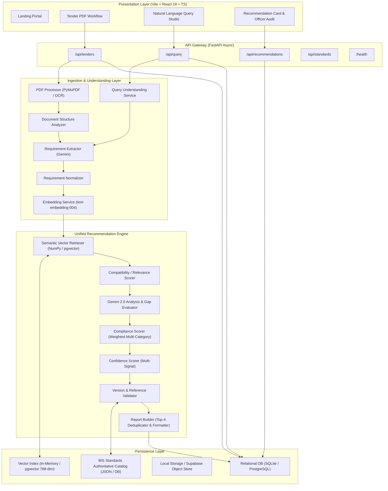
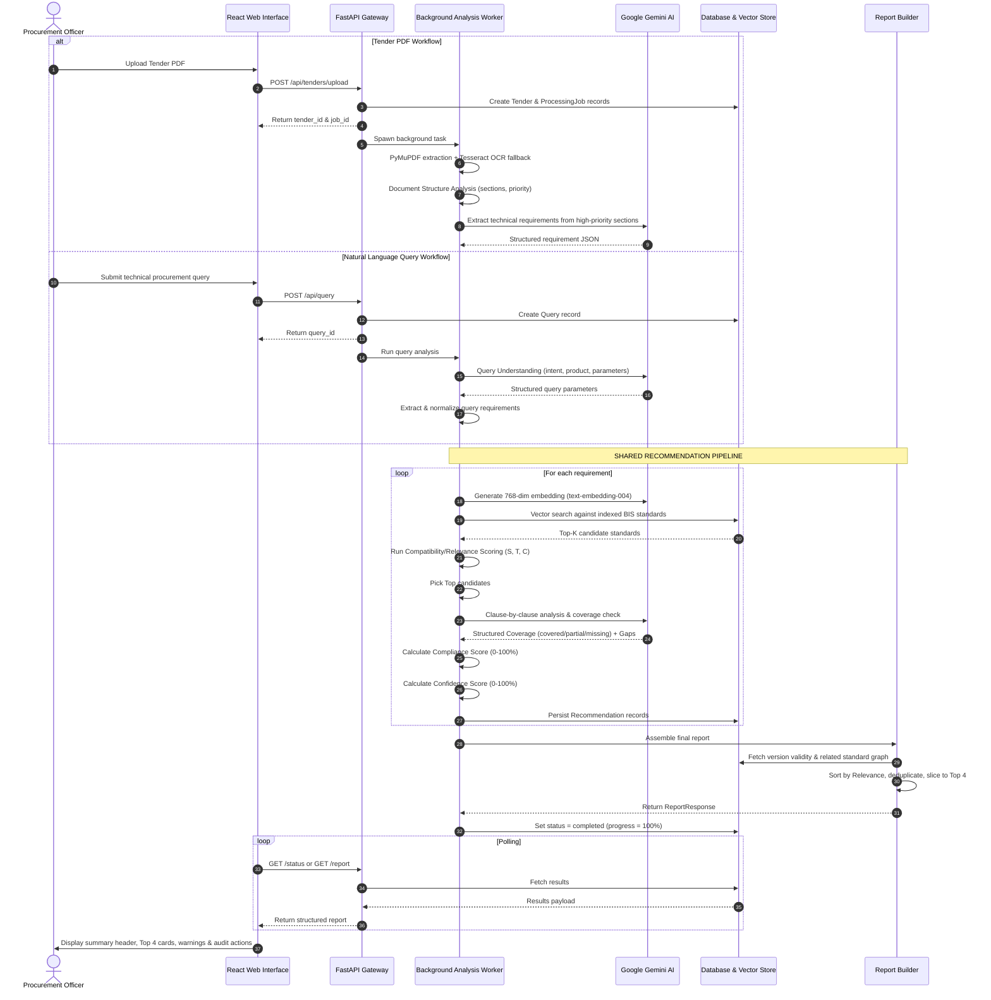
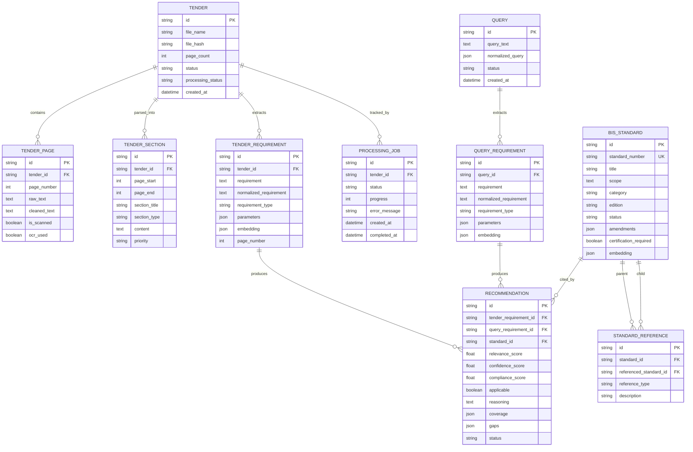

# Procura — System Architecture Document
**AI-Powered Recommendation Engine for Identifying Applicable Indian Standards for Procurement Specifications**  
*Smart India Hackathon (SIH) — Problem Statement 26108*

---

## 1. Executive Summary & Core Philosophy

**Procura** is an enterprise-grade recommendation engine built to assist public and private procurement officers in identifying, validating, and citing mandatory and recommended Bureau of Indian Standards (BIS) specifications. 

### Core Architectural Tenet: Zero-Hallucination Recommendation
Unlike conversational generative bots, Procura adheres to a **deterministic zero-hallucination policy**:
1. **Authoritative Grounding:** LLMs do **not** invent or suggest BIS standards out of thin air. Standards are retrieved exclusively from an indexed, authoritative BIS standards repository.
2. **Role of Generative AI:** Google Gemini 2.0 Flash is utilized solely for *semantic extraction* (parsing complex tenders into structured requirements) and *structured gap analysis* (evaluating requirement-to-scope provisions).
3. **Deterministic Scoring:** All scores (Compatibility/Relevance, Compliance, and Confidence) are computed by mathematical scoring engines using explicit weightings, not subjective model guesses.
4. **Officer-in-the-Loop Auditability:** Every recommendation provides verifiable evidence, key provisions, specific clause references, amendment notes, and official Accept/Reject audit actions for procurement officers.

---

## 2. High-Level Architecture

The system is structured as a decoupled, multi-tier architecture consisting of a **React/TypeScript Frontend**, a **FastAPI Asynchronous Gateway**, specialized **Ingestion & Processing Pipelines**, a **Unified Recommendation Engine**, and a **Dual-Mode Vector/Relational Data Layer**.

---

## 3. End-to-End Data Flow

Both raw tender documents (PDFs) and user natural language queries converge into an identical, shared recommendation pipeline.

### 3.1 Workflow Sequence Diagram

---

## 4. Scoring Engine Mechanics

The Procura scoring subsystem is built around three isolated mathematical dimensions: **Compatibility Score ($CS$)**, **Compliance Score ($Comp$)**, and **Confidence Score ($Conf$)**.

### 4.1 Compatibility Score Formula ($CS$)
Compatibility answers: *"How suitable is this standard to the stated procurement requirement?"*

$$\boxed{ CS = 0.30S + 0.25T + 0.20C + 0.15V + 0.10R }$$

Where all sub-scores are normalized on a $[0, 100]$ scale:

| Metric | Factor | Meaning | Method of Calculation |
| :--- | :---: | :--- | :--- |
| **$S$** | **30%** | **Semantic Similarity** | Cosine similarity between requirement vector and standard vector: $\max(0, \cos(\mathbf{u}, \mathbf{v})) \times 100$. |
| **$T$** | **25%** | **Technical Match** | Overlap of technical parameters, product classifications, and material properties between tender and standard. |
| **$C$** | **20%** | **Scope Compatibility** | Keyword and contextual matching of the standard’s official scope against the requirement application. |
| **$V$** | **15%** | **Version Validity** | Current active edition ($100$), under review ($70$), superseded ($30$), or withdrawn ($0$). |
| **$R$** | **10%** | **Relationship Relevance** | Knowledge graph density: connections via testing, product specification, and safety references in `standard_references`. |

### 4.2 Compliance Score Formula ($Comp$)
Compliance answers: *"How thoroughly does this standard fulfill all functional and safety criteria of the specification?"*

Compliance is computed **after** Gemini structured gap assessment:
1. Gemini categorizes provisions into 9 standardized inspection categories: `product_type`, `performance`, `safety`, `material`, `testing`, `electrical`, `mechanical`, `marking`, `documentation`.
2. Each category is assigned a coverage status weight:
   - **Covered:** $1.0$
   - **Partial:** $0.5$
   - **Missing:** $0.0$
   - **Not Applicable:** Excluded from the denominator.
3. Category importance weights are applied:

$$Comp = \frac{\sum_{i \in \text{Applicable}} W_{\text{category}, i} \times W_{\text{status}, i}}{\sum_{i \in \text{Applicable}} W_{\text{category}, i}} \times 100$$

> **Generic Query Safeguard:** If a query provides insufficient technical parameters, $Comp$ is explicitly returned as `null` with a compliance note, avoiding misleading scores on open-ended queries.

### 4.3 Confidence Score Formula ($Conf$)
Confidence answers: *"How confident is the system in the reliability of this recommendation?"*

$$Conf = 0.30 \times \text{RetrievalSignal} + 0.30 \times \text{SimilarityStrength} + 0.20 \times \text{ScopeMatch} + 0.20 \times \text{EvidenceAvailability}$$

- **Retrieval Signal:** Ranks candidates by score drop-off from the #1 candidate.
- **Evidence Availability:** Scored based on key clause provisions extracted directly from authoritative documentation.

---

## 5. Database Schema & Entity Relationships

The relational model tracks documents, extracted sections, atomic requirements, authoritative standards, and final recommendation reports.

---

## 6. Service Directory & Component Responsibilities

### Backend (`backend/app/`)

| Directory / Module | Key Files | Responsibility |
| :--- | :--- | :--- |
| **`core/`** | `config.py`, `database.py`, `logging.py` | Environment config, database session lifecycle, logger tokens. |
| **`models/`** | `tender.py`, `requirement.py`, `bis_standard.py`, `recommendation.py`, `query.py`, `processing_job.py` | SQLAlchemy declarative database models. |
| **`schemas/`** | `tender.py`, `query.py`, `recommendation.py`, `standard.py` | Pydantic validation and serializable response models. |
| **`api/routes/`** | `tenders.py`, `query.py`, `recommendations.py`, `standards.py`, `health.py` | Asynchronous REST endpoints and request handlers. |
| **`services/`** | `pdf_processor.py`, `ocr_service.py` | PDF text extraction using PyMuPDF and Tesseract OCR engine. |
| | `document_structure.py` | Boundary detection, running header deduplication, priority scoring. |
| | `query_understanding.py` | Natural language intent extraction, parameter parsing. |
| | `requirement_extractor.py` | Gemini-driven requirement decomposition from text. |
| | `requirement_normalizer.py` | Parameter cleaning, unit standardization, product classification. |
| | `embedding_service.py` | Batch vector generation using Google `text-embedding-004`. |
| | `retrieval_service.py` | Semantic cosine retrieval across indexed BIS standards catalog. |
| | `relevance_scorer.py` | Deterministic Compatibility/Relevance mathematical engine. |
| | `gemini_service.py` | Async structured analysis and key provision extraction. |
| | `compliance_scorer.py` | Multi-category weighted compliance calculation. |
| | `confidence_scorer.py` | Multi-signal recommendation confidence evaluator. |
| | `standards_service.py` | Version verification and relational graph reference traversal. |
| | `certification_service.py` | Mandatory vs voluntary certification validation (ISI Mark, CRS). |
| | `report_builder.py` | Deduplication, top-4 ranking, and final report compilation. |
| **`workers/`** | `analysis_worker.py` | Background orchestration connecting ingestion to scoring. |

### Frontend (`frontend/src/`)

| Module / View | Responsibility |
| :--- | :--- |
| **`App.tsx`** | Top-level routing and view state coordination (`landing`, `query`, `tender`). |
| **`views/LandingPage.tsx`** | Portal home introducing Procura, feature highlights, and workflow triggers. |
| **`views/TenderWorkflow.tsx`** | Drag-and-drop PDF upload, stage progress bar, and summary results view. |
| **`views/QueryWorkflow.tsx`** | Free-text technical query input, sample suggestions, and results presentation. |
| **`views/RecommendationCard.tsx`** | Numbered recommendation cards (`#01` to `#04`), "Why?" section, officer actions (Accept/Reject), and expandable detailed report (coverage table, gaps, version, certification). |
| **`views/StatusBadge.tsx`** | Color-coded status tokens for recommendation state (`Accepted`, `Rejected`, `Pending`). |
| **`views/ProgressBar.tsx`** | Animated stage indicator for asynchronous background processing jobs. |
| **`api/client.ts`** | Typed Fetch client wrapper communicating with the FastAPI backend. |

---

## 7. Key Operational Algorithms

### 7.1 Section Priority Heuristic
To prevent token exhaustion and rate limits on 100+ page tenders, the `DocumentStructureAnalyzer` classifies sections:
- **High Priority:** Sections matching `technical specifications`, `scope of work`, `bill of quantities`, `equipment schedule`, `material requirements`.
- **Medium Priority:** Sections matching `general conditions`, `evaluation criteria`.
- **Low Priority (Skipped):** Sections matching `tender fee`, `earnest money deposit (EMD)`, `eligibility documents`, `format of bank guarantee`.

### 7.2 Top-4 Recommendation Deduplication
When multiple extracted tender requirements match the same standard (e.g., both concrete grade and reinforcement refer to IS 456), `report_builder.py`:
1. Ranks all candidates by overall score descending.
2. Deduplicates candidates by unique `standard_number`.
3. Slices the result to the **top 4 distinct recommendations**.
4. Enriches exclusively those 4 candidates with full version, certification, and relationship data to guarantee fast execution and clean UI rendering.

---

## 8. Technology Stack Summary

| Layer | Technology / Library | Role |
| :--- | :--- | :--- |
| **Frontend Framework** | React 18, TypeScript, Vite | Single-page application, type-safe development |
| **Styling & Design** | TailwindCSS + Curated CSS Tokens | Government portal theme (Navy `#1e3a8a`, Saffron accents, Inter typography) |
| **Backend Framework** | FastAPI, Python 3.11+, Uvicorn | Async ASGI server, OpenAPI auto-documentation |
| **ORM & Persistence** | SQLAlchemy 2.0 (Async), aiosqlite | Asynchronous relational mapping |
| **Vector Engine** | NumPy (Prototype) / pgvector (Prod) | 768-dimensional cosine similarity indexing |
| **Document Processing** | PyMuPDF (fitz), pdf2image, pytesseract | Hybrid digital and scanned PDF text extraction |
| **LLM & Embeddings** | Google Gemini 2.0 Flash, text-embedding-004 | Semantic extraction, clause auditing, text embeddings |

---

## 9. Production Roadmap & Scalability Strategy

1. **Storage Tier:** Replace local SQLite database with PostgreSQL with `pgvector` for scalable HNSW index searching across 25,000+ BIS standards.
2. **Worker Tier:** Move background tasks from in-process asyncio tasks to distributed **Celery / Redis** or **Temporal** workers.
3. **Document Store:** Offload PDF storage to S3 or Supabase Storage with signed presigned URLs.
4. **Knowledge Graph:** Enhance `StandardReference` traversal using a graph database (e.g., Neo4j) to visualize complex standard hierarchies (Safety $\to$ Testing $\to$ Product).
